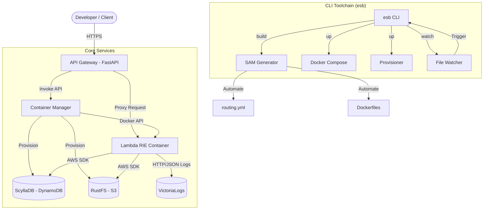

# Edge Serverless Box

**オンプレミス・エッジ環境のための、自己完結型サーバーレス実行基盤**
*(A self-contained, serverless-compatible environment for edge and local development)*

### 特徴
- **True AWS Compatibility**: 実行エンジンに **AWS Lambda Runtime Interface Emulator (RIE)** を採用。クラウド上の Lambda と完全に一致する挙動をローカル環境で保証します。
- **Integrated Developer Experience (CLI)**: 専用 CLI ツール `esb` を提供。環境構築からホットリロード開発まで、コマンド一つでシームレスな開発体験を提供します。
- **Production-Ready Architecture**: 外部公開用の `Gateway` と特権を持つ `Manager` を分離したマイクロサービス構成により、セキュリティと耐障害性を実現しています。
- **Full Stack in a Box**: S3互換ストレージ (RustFS)、DynamoDB互換DB (ScyllaDB)、ログ基盤を同梱しており、`esb up` だけで完全なクラウドネイティブ環境が手に入ります。
- **Efficient Orchestration**: DinD (Docker in Docker) 技術により、Lambda関数コンテナをオンデマンドで起動し、アイドル時に自動停止することでリソースを最適化します。

### CLI コマンド一覧

| コマンド | 説明 | 主なオプション |
| --- | --- | --- |
| `esb build` | `template.yaml` から設定を生成し、Docker イメージをビルドします。 | `--no-cache` |
| `esb up` | サービスの起動とインフラのプロビジョニングを一括で行います。 | `--build`, `--detach (-d)` |
| `esb watch` | ファイル変更を監視し、自動的にリロード・リビルドを実行します。 | - |
| `esb down` | サービスを停止し、コンテナを削除します。 | `--volumes (-v)` |
| `esb reset` | 環境を完全に初期化し、DB等のデータも全て削除して再構築します。 | - |

## アーキテクチャ



### システムコンポーネント
- **`Gateway`**: API Gateway 互換プロキシ。`routing.yml` に基づき認証・ルーティングを行い、Manager を介して Lambda コンテナをオンデマンドで呼び出します。
- **`Manager`**: コンテナのライフサイクル管理を担当。DinD 技術を用いて Lambda RIE コンテナを管理し、リソース（DB/S3）のプロビジョニングも実行します。
- **`esb CLI`**: SAM テンプレート (`template.yaml`) を **Single Source of Truth** とし、開発を自動化する統合コマンドラインツールです。

### ファイル構成
```text
.
├── docker-compose.yml       # 開発用サービス構成
├── services/
│   ├── gateway/             # API Gateway (FastAPI)
│   └── manager/             # Container Manager
├── config/                  # 設定ファイル
├── tools/
│   ├── cli/                 # ★ ESB CLI ツール (New)
│   ├── generator/           # SAM Template Generator
│   └── provisioner/         # Infrastructure Provisioner
├── tests/
│   ├── e2e/                 # E2Eテスト用Lambda関数
│   │   ├── template.yaml    # SAM Source of Truth
│   │   └── functions/       # Lambda関数コード

```

## クイックスタート

### 開発環境セットアップ

本プロジェクトは Python 製の CLI ツール `esb` を使用して操作します。

```bash
# 1. 仮想環境作成と依存関係インストール
uv venv
.venv\Scripts\activate  # Windows
# source .venv/bin/activate  # macOS/Linux

# 依存パッケージ（CLI含む）のインストール
uv pip install -e ".[dev]"

# 2. Git hooks のセットアップ
cd ..
lefthook install

```

### サービスの起動 (`esb up`)

ビルド、コンテナ起動、インフラ（DB/S3）のプロビジョニングを一括で行います。

```bash
# 環境を起動（初回はビルドも実行されます）
esb up

# 強制的に再ビルドして起動する場合
esb up --build

```

起動後、以下のURLでサービスが利用可能です：

* **Gateway API**: `https://localhost:443`
* **VictoriaLogs**: `http://localhost:9428`

### 開発モード / ホットリロード (`esb watch`)

ファイルの変更を検知して、自動的にビルドや再設定を行う「監視モード」です。
開発中は別のターミナルでこのコマンドを実行したままにすることを推奨します。

```bash
esb watch

```

* **`template.yaml` を変更した場合**:
* 設定ファイルの再生成
* Gateway のルーティング更新（再起動）
* 新規リソース（DynamoDBテーブル等）の自動作成


* **Lambda関数コード (`.py`) を変更した場合**:
* 対象関数の Docker イメージのみ高速リビルド
* 実行中のコンテナを停止（次回リクエスト時に新コードで起動）


### 環境の停止 (`esb down`)

コンテナおよびネットワークリソースをクリーンに削除します。

```bash
# サービスを停止
esb down

# ボリューム（DBのデータやS3のファイル）も含めて完全に削除する場合
esb down --volumes
```

### 環境の完全リセット (`esb reset`)

DB の状態が複雑になった場合や、クリーンな状態からやり直したい場合に使用します。
**注意: この操作を実行すると、全てのデータベーステーブルと S3 バケットの内容が永久に失われます。** 実行前に確認プロンプトが表示されます。

```bash
esb reset
```

内部的には以下の処理を連続して行います：
1. `esb down --volumes` (データを含む完全削除)
2. `esb up --build` (イメージの再ビルドとクリーンな起動)

## 開発ガイド

### SAM Template Generator

本プロジェクトでは、Lambda関数の構成管理を `template.yaml` に一本化しています。
手動で Dockerfile や `routing.yml` を編集する必要はありません。

#### 新しいLambda関数の追加手順

1. **`tests/e2e/template.yaml` を編集**:
新しい `AWS::Serverless::Function` リソースを追加します。`Events` プロパティで API パスを定義してください。
```yaml
MyFunction:
  Type: AWS::Serverless::Function
  Properties:
    FunctionName: lambda-my-func
    CodeUri: functions/my-func/
    Handler: lambda_function.lambda_handler
    Runtime: python3.12
    Events:
      ApiEvent:
        Type: Api
        Properties:
          Path: /api/my-func
          Method: get

```


2. **コードの配置**:
`tests/e2e/functions/my-func/lambda_function.py` を作成します。
3. **反映**:
`esb watch` が起動していれば、保存した瞬間に自動的に環境に反映されます。
手動で反映する場合は `esb build && esb up` を実行してください。

### Infrastructure as Code (IaC)

DynamoDB テーブルや S3 バケットも `template.yaml` で管理されます。

```yaml
MyTable:
  Type: AWS::DynamoDB::Table
  Properties:
    TableName: my-table
    KeySchema:
      - AttributeName: id
        KeyType: HASH
    AttributeDefinitions:
      - AttributeName: id
        AttributeType: S
    BillingMode: PAY_PER_REQUEST

```

上記を追記保存すると、ローカルの ScyllaDB に自動的にテーブルが作成されます（`Provisioner` 機能）。

### テスト実行

E2EテストはDinD環境を起動して実行されます。

```bash
python tests/run_tests.py

```

## トラブルシューティング

**Q. `esb` コマンドが見つからない**
A. 仮想環境 (`.venv`) がアクティベートされているか確認してください。または `uv run esb ...` で実行できます。

**Q. コンテナの挙動がおかしい**
A. 一度環境を完全にリセットしてください。

```bash
esb down
esb up --build

```
