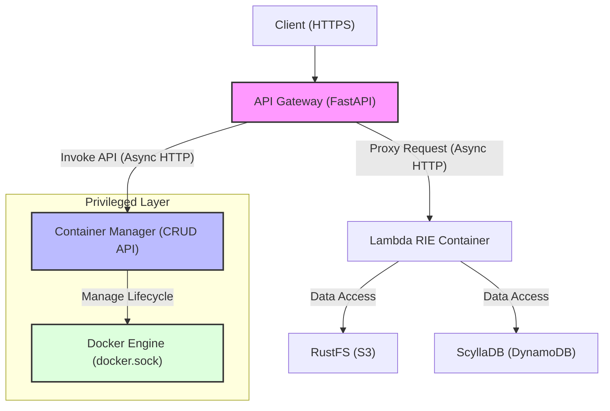

# Edge Serverless Box

**オンプレミス・エッジ環境のための、自己完結型サーバーレス実行基盤**
*(A self-contained, serverless-compatible environment for edge and local development)*

### 特徴
- **True AWS Compatibility**: 実行エンジンに **AWS Lambda Runtime Interface Emulator (RIE)** を採用。クラウド上の Lambda と完全に一致する挙動をローカル環境で保証します。
- **Production-Ready Architecture**: 外部公開用の `Gateway` と特権を持つ `Manager` を分離したマイクロサービス構成により、開発用モックにとどまらず、実運用にも耐えうるセキュリティと耐障害性を実現しています。
- **Full Stack in a Box**: S3互換ストレージ (RustFS)、DynamoDB互換DB (ScyllaDB)、ログ基盤を同梱しており、`docker compose up` だけで完全なクラウドネイティブ環境が手に入ります。
- **Efficient Orchestration**: DinD (Docker in Docker) 技術により、Lambda関数コンテナをオンデマンドで起動し、アイドル時に自動停止（デフォルト5分）することでリソースを最適化します。

## アーキテクチャ

本システムは、セキュリティの向上とリソース管理の最適化のため、**API Gateway (Facade)** と **Container Manager (Orchestrator)** を分離したマイクロサービス構成を採用しています。

### 分離の意義とメリット
1. **セキュリティ（最小権限の原則）**:
   - `docker.sock` へのアクセス権を **Manager サービスのみ**に限定。
   - 外部に公開される `Gateway` は Docker 操作権限を持たないため、万一 Gateway が侵害されてもホスト全体の制御を奪われるリスクを低減します。
2. **信頼性と堅牢性**:
   - **ゾンビコンテナ対策 & 状態復元**: Manager が起動時に既存のコンテナ状態を Docker から同期（Adopt & Sync）し、実行中のコンテナは管理下に復帰、停止中のコンテナのみクリーンアップします。Manager 再起動時もサービス断を最小化します。
   - **アイドル監視**: バックグラウンドスケジューラーがアイドル状態のコンテナを常時監視・停止します（デフォルト5分）。
   - **関心の分離**: Gateway は認証とルーティングに、Manager はライフサイクル管理に専念することで、コードの肥大化と密結合を防止しています。
3. **パフォーマンス**:
   - Gateway は `httpx` による完全非同期プロキシとして動作し、多数の同時リクエストを効率的に処理します。
   - **コンテナホストキャッシュ**: Gateway はコンテナの起動状態を TTL 付き LRU キャッシュで保持し、Warm Start 時は Manager への問い合わせをスキップしてレイテンシを削減します。

### 構成図



### サービス一覧
ホストOS、またはDinD親コンテナ上で以下のサービス群が動作します。

| サービス         | ポート | 役割                         | URL                     |
| ---------------- | ------ | ---------------------------- | ----------------------- |
| **Gateway API**  | `443`  | 認証・ルーティング・プロキシ | `https://localhost:443` |
| **Manager API**  | -      | コンテナの選定・起動・停止   | (内部通信のみ)          |
| **RustFS API**   | `9000` | S3互換オブジェクトストレージ | `http://localhost:9000` |
| **ScyllaDB**     | `8001` | DynamoDB互換DB               | `http://localhost:8001` |
| **VictoriaLogs** | `9428` | ログ管理 Web UI              | `http://localhost:9428` |

### ファイル構成
```
.
├── docker-compose.yml       # 開発用サービス構成
├── docker-compose.test.yml  # E2Eテスト用オーバーライド
├── services/
│   ├── gateway/             # ステートレスな API ゲートウェイ
│   │   ├── main.py              # ルーティング & プロキシロジック
│   │   ├── client.py            # Manager 呼び出しクライアント
│   │   └── config.py            # 設定管理
│   └── manager/             # ステートフルなコンテナオーケストレーター
│       ├── main.py              # ライフサイクル API & スケジューラー
│       └── service.py           # Docker Python SDK を用いた操作
├── config/                  # 設定ファイル
│   ├── functions.yml        # Lambda 関数定義
│   ├── routing.yml          # ルーティング定義
│   └── gateway_log.yaml     # 構造化ログ設定
├── tools/generator/         # SAM Template Generator
│   ├── parser.py            # SAMテンプレートパーサー
│   ├── renderer.py          # Dockerfile/functions.yml生成
│   ├── main.py              # CLIエントリーポイント
│   ├── lib/                 # Lambda ランタイムパッチ
│   │   └── sitecustomize.py     # boto3モンキーパッチ (S3/DynamoDB/Lambda/Logs)
│   └── tests/               # 単体テスト
│       └── lib/
│           └── test_sitecustomize.py
├── tests/
│   ├── e2e/                 # E2Eテスト用Lambda関数
│   │   ├── template.yaml    # SAM Source of Truth
│   │   ├── functions/       # Lambda関数 & 生成Dockerfile
│   │   └── config/          # 生成された設定ファイル
│   ├── test_e2e.py          # E2Eテストスイート
│   └── run_tests.py         # テストランナー
```

## クイックスタート

### 1. 開発モード (推奨)
ホスト上のDockerで直接サービス群を起動します。開発の反復に最適です。
```bash
# 起動
docker compose up -d

# 停止
docker compose down
```

#### 構成・ネットワーク設定（環境変数）
| 変数名                 | デフォルト               | 説明                                             |
| ---------------------- | ------------------------ | ------------------------------------------------ |
| `IDLE_TIMEOUT_MINUTES` | `5`                      | アイドル状態のLambdaコンテナを停止するまでの分数 |
| `LAMBDA_NETWORK`       | `onpre-internal-network` | Lambdaコンテナが参加するDockerネットワーク名     |
| `CONTAINER_CACHE_TTL`  | `30`                     | Gateway のコンテナホストキャッシュ TTL（秒）     |


```bash
# 例: アイドルタイムアウトを15分に設定
IDLE_TIMEOUT_MINUTES=15 docker compose up -d
```

### 2. 本番/DinDモード
商用環境を模した、単一コンテナ(DinD)内で全サービスを起動します。
```bash
# 起動
docker compose -f docker-compose.dind.yml up -d

# ログ確認
docker logs -f onpre-app-root
```

## 開発ガイド

### 開発環境セットアップ
```bash
# 1. 仮想環境作成と依存関係インストール
uv venv
.venv\Scripts\activate  # Windows
# source .venv/bin/activate  # macOS/Linux
uv pip install -e ".[dev]"

# 2. Git hooks のセットアップ
cd ..
lefthook install
```

### テスト実行
E2EテストはDinD環境を起動して実行されます。
```bash
python tests/run_tests.py --build
```
※ `--build` オプションで再ビルド可能。

### トラブルシューティング

#### Docker リソースの競合エラー

リポジトリ名を変更した場合や、以下のようなエラーが発生した場合は、古いDockerリソースをクリーンアップしてください:

```
WARN a network with name test-external exists but was not created for project "edge-serverless-box"
Error: The container name "/onpre-database" is already in use
```

**解決方法:**
```bash
# 既存のコンテナとネットワークを削除
docker compose -f docker-compose.yml -f tests/docker-compose.test.yml down --remove-orphans -v

# 不要なネットワークとコンテナを一括削除
docker network prune -f
docker container prune -f

# テストを再実行
python tests/run_tests.py --reset
```

> **Note**: `--reset` オプションを使用すると、イメージも含めて完全にクリーンアップしてから再ビルドします。


### SAM Template Generator
SAMテンプレートからDockerfileと構成ファイルを自動生成するツールです。
本プロジェクトでは、Lambda関数の構成管理を `template.yaml` に一本化しています。

#### 基本的な使い方
```bash
python -m tools.generator.main --config tests/e2e/generator.yml
```

#### Lambda関数の追加手順
1. **`tests/e2e/template.yaml` を編集**:
   新しい `AWS::Serverless::Function` リソースを追加します。
   ```yaml
   MyFunction:
     Type: AWS::Serverless::Function
     Properties:
       FunctionName: lambda-my-func
       CodeUri: functions/my-func/
       Handler: lambda_function.lambda_handler
       Runtime: python3.12
   ```

2. **コードの配置**:
   `tests/e2e/functions/my-func/lambda_function.py` を作成します。
   ```python
   def lambda_handler(event, context):
       return {"statusCode": 200, "body": "Hello"}
   ```

3. **生成実行**:
   ```bash
   python -m tools.generator.main --config tests/e2e/generator.yml
   ```
   これにより、以下が自動生成されます:
   - `tests/e2e/functions/my-func/Dockerfile`
   - `tests/e2e/config/functions.yml` (Gateway設定)

4. **テスト実行**:
   ```bash
   python tests/run_tests.py --build
   ```


### API利用例 (Gateway)

**認証:**
```bash
curl -k -X POST https://localhost:443/user/auth/ver1.0 \
  -H "x-api-key: dev-api-key-change-in-production" \
  -H "Content-Type: application/json" \
  -d '{"AuthParameters": {"USERNAME": "onpremise-user", "PASSWORD": "onpremise-pass"}}'
```
> `-k` オプションは自己署名証明書を許可します。

**S3互換アクセス:**
AWS SDK等からは `http://localhost:9000` をエンドポイントとして指定してください。

## 詳細ドキュメント
- [システム仕様書](docs/spec.md)
- [クライアント認証仕様](docs/client-auth-spec.md)
- [ログ収集アダプター](docs/local-logging-adapter.md)
- [ネットワーク解決の最適化（IPベース）](docs/network-optimization.md)
- [コンテナキャッシュによるレイテンシ最適化](docs/container-cache.md)
- [Manager再起動時のコンテナ復元（Adopt & Sync）](docs/manager-restart-resilience.md)
