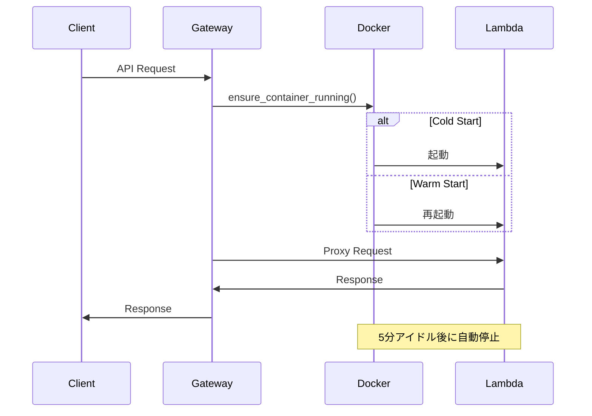

# Sample DinD Lambda Simulator
Docker in Docker (DinD) 技術を活用した、オンプレミス環境向けのエッジサーバーレス・シミュレーターです。

## 特徴
- **Pure DinD**: 1つの親コンテナ内に Gateway, Storage, DB, Lambda 等の全サービスを集約。
- **Serverless-like**: Lambda関数はオンデマンドで起動し、アイドル時に自動停止（デフォルト5分）。
- **Direct Access**: リバースプロキシを排し、各サービスへHTTPポートで直接アクセス可能。
- **Hybrid Dev**: 開発用 (`docker-compose.yml`) と 本番用 (`docker-compose.dind.yml`) をシームレスに切り替え。

## アーキテクチャ



### 構成
ホストOS、またはDinD親コンテナ上で以下のサービス群が動作します。

| サービス           | ポート | 役割                         | URL                     |
| ------------------ | ------ | ---------------------------- | ----------------------- |
| **Gateway API**    | `8000` | Lambda関数管理・実行         | `http://localhost:8000` |
| **RustFS API**     | `9000` | S3互換オブジェクトストレージ | `http://localhost:9000` |
| **RustFS Console** | `9001` | S3管理 Web UI                | `http://localhost:9001` |
| **ScyllaDB**       | `8001` | DynamoDB互換DB (Alternator)  | `http://localhost:8001` |
| **VictoriaLogs**   | `9428` | ログ管理 Web UI              | `http://localhost:9428` |

### ファイル構成
```
.
├── docker-compose.yml       # [開発/内部用] サービス定義 (相対パス ./data)
├── docker-compose.dind.yml  # [本番用] DinD親コンテナ起動 (マウント調整)
├── Dockerfile              # DinD親コンテナのビルド定義
├── entrypoint.sh           # 親コンテナ起動スクリプト
├── gateway/                # FastAPIアプリケーション
│   └── app/
│       ├── main.py         # エンドポイント定義
│       ├── config.py       # 設定管理
│       ├── core/           # 認証・プロキシロジック
│       │   ├── security.py # JWT認証
│       │   └── proxy.py    # Lambda転送
│       ├── models/         # Pydanticスキーマ
│       │   └── schemas.py
│       └── services/       # ビジネスロジック
│           ├── container.py      # コンテナ管理
│           ├── route_matcher.py  # ルーティング
│           └── scheduler.py      # 定期実行
├── lambda_functions/       # ユーザー関数コード
├── tests/                  # E2Eテスト
└── docs/                   # 仕様書
```

## クイックスタート

### 1. 開発モード (推奨)
ホスト上のDockerで直接サービス群を起動します。開発の反復に最適です。
```bash
# 起動
docker compose up -d

# 停止
docker compose down
```

#### Lambda設定（環境変数）
| 変数名 | デフォルト | 説明 |
|--------|-----------|------|
| `IDLE_TIMEOUT_MINUTES` | `5` | アイドル状態のLambdaコンテナを停止するまでの分数 |
| `DOCKER_NETWORK` | `sample-dind-lambda_default` | Lambdaコンテナが参加するDockerネットワーク |

```bash
# 例: アイドルタイムアウトを15分に設定
IDLE_TIMEOUT_MINUTES=15 docker compose up -d
```

### 2. 本番/DinDモード
商用環境を模した、単一コンテナ(DinD)内で全サービスを起動します。
```bash
# 起動
docker compose -f docker-compose.dind.yml up -d

# ログ確認
docker logs -f onpre-app-root
```

## 開発ガイド

### 開発環境セットアップ
```bash
# 1. 仮想環境作成と依存関係インストール
cd gateway
uv venv
.venv\Scripts\activate  # Windows
# source .venv/bin/activate  # macOS/Linux
uv pip install -e ".[dev]"

# 2. Git hooks のセットアップ
cd ..
lefthook install
```

### テスト実行
E2EテストはDinD環境を起動して実行されます。
```bash
python tests/run_tests.py --build
```
※ `--build` オプションで再ビルド可能。

### API利用例 (Gateway)

**認証:**
```bash
curl -X POST http://localhost:8000/user/auth/ver1.0 \
  -H "x-api-key: dev-api-key-change-in-production" \
  -H "Content-Type: application/json" \
  -d '{"AuthParameters": {"USERNAME": "onpremise-user", "PASSWORD": "onpremise-pass"}}'
```

**S3互換アクセス:**
AWS SDK等からは `http://localhost:9000` をエンドポイントとして指定してください。

## 詳細ドキュメント
- [システム仕様書](docs/spec.md)
- [クライアント認証仕様](docs/client-auth-spec.md)
- [ログ収集アダプター](docs/local-logging-adapter.md)
