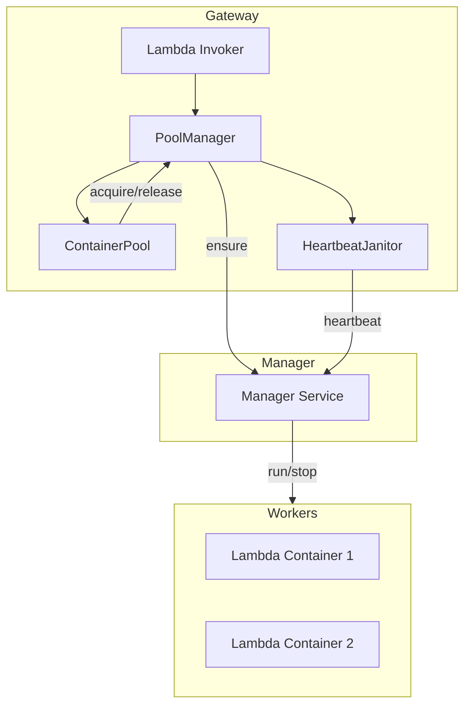

# オートスケーリングとコンテナ・プーリング

## 概要

Edge Serverless Box (ESB) は、Lambda 関数の同時実行リクエストを効率的に処理し、リソースの利用効率を最大化するために、セマフォベースのオートスケーリングとコンテナ・プーリング機能を備えています。

この機能により、バースト的なリクエストに対しては自動的にコンテナをプロビジョニングし、アイドル状態のコンテナはプールに返却して再利用、または一定時間後にクリーンアップすることで、クラウドに近い実行モデルをローカル環境で実現します。

## アーキテクチャ

オートスケーリング機能は主に Gateway サービス内の `PoolManager` によって制御されます。



### 主要コンポーネント

1.  **`PoolManager`**: Gateway のエントリポイント。リクエストごとに `ContainerPool` からワーカーを取得（またはプロビジョニングを要求）し、実行後に返却します。
2.  **`ContainerPool`**: 特定の関数ごとのコンテナインスタンスを管理します。`asyncio.Semaphore` を使用して同時実行数 (`max_capacity`) を制御します。
3.  **`HeartbeatJanitor`**: 稼働中の全コンテナのリストを定期的に `Manager` に送信します。これにより、Manager は「現在 Gateway が使用しているコンテナ」を正確に把握し、誤ったクリーンアップを防ぎます。
4.  **`Manager Service`**: コンテナの実体（Dockerコンテナ）の起動・停止を担当します。Gateway から届くハートビートに基づき、長期間未使用のコンテナを安全に削除します。

## 設定

オートスケーリングの挙動は `template.yaml` および環境変数で制御可能です。

### SAM テンプレート設定

`AWS::Serverless::Function` の `ReservedConcurrentExecutions` プロパティが、その関数の最大同時実行数（プールのキャパシティ）として使用されます。

```yaml
MyFunction:
  Type: AWS::Serverless::Function
  Properties:
    FunctionName: my-function
    ReservedConcurrentExecutions: 5  # 最大5コンテナまで並列稼働
    # ...
```

*   **未指定の場合**: デフォルト値（通常 50）が適用されます。
*   **0 の場合**: 同時実行が禁止されます。

### 環境変数 (Gateway)

| 変数名                     | 説明                                                | デフォルト値 |
| -------------------------- | --------------------------------------------------- | ------------ |
| `ENABLE_CONTAINER_POOLING` | オートスケーリング機能（コンテナプール）の有効/無効 | `False`      |
| `HEARTBEAT_INTERVAL`       | Manager へのハートビート送信間隔（秒）              | `30`         |
| `POOL_ACQUIRE_TIMEOUT`     | 全ワーカーが使用中の場合の待機タイムアウト（秒）    | `5.0`        |

## 動作原理

### 1. リクエスト受付とキャパシティ確保
リクエストが届くと、`PoolManager` は対象関数の `ContainerPool` に対してセマフォの取得 (`acquire`) を試みます。

*   **アイドルコンテナがある場合**: 即座にそのコンテナを割り当てます（再利用）。
*   **空きはないがキャパシティに余裕がある場合**: 新規コンテナのプロビジョニングを `Manager` に要求し、起動完了後に割り当てます。
*   **フル稼働状態の場合**: セマフォが解放されるまで待機（キューイング）します。
    *   `POOL_ACQUIRE_TIMEOUT` を経過しても空きが出ない場合は `503 Service Unavailable` を返します。

### 2. リソースの解放
Lambda の実行が完了（成功・失敗・タイムアウト問わず）すると、コンテナはプールに返却 (`release`) され、待機中の次のリクエストが利用可能になります。

### 3. Scale to Zero (スケールダウン)
リクエストが一定時間（Manager 側の `idle_timeout`：デフォルト 5分）途絶えたコンテナは、Manager によって自動的に停止・削除されます。

*   **メリット**: 未使用のリソースを完全に解放し、エッジ環境の限られた CPU/メモリを節約します。
*   **注意点**: 0 個の状態から最初のリクエストが届いた際は、コンテナの起動待ち（Cold Start）が発生し、レスポンス時間が数秒増加します。

### 4. セルフヒーリングとクリーンアップ
コンテナがクラッシュしたり、通信エラーが発生した場合、`evict` メソッドによってプールから除外されます。この際もセマフォは解放されるため、システム全体のデッドロックを防ぎつつ、次のリクエストで新しいコンテナが作成されます。

長期間リクエストがないコンテナは、Manager 側の Janitor ロジックによって自動的に停止・削除されます。

## 注意事項

*   **Cold Start**: 新規プロビジョニング時は Docker コンテナの起動時間がかかるため、レイテンシが増加します（コールドスタート）。
*   **Docker Socket**: Manager が Docker API を操作するため、DinD 環境では適切な Docker Socket のマウントが必要です。
