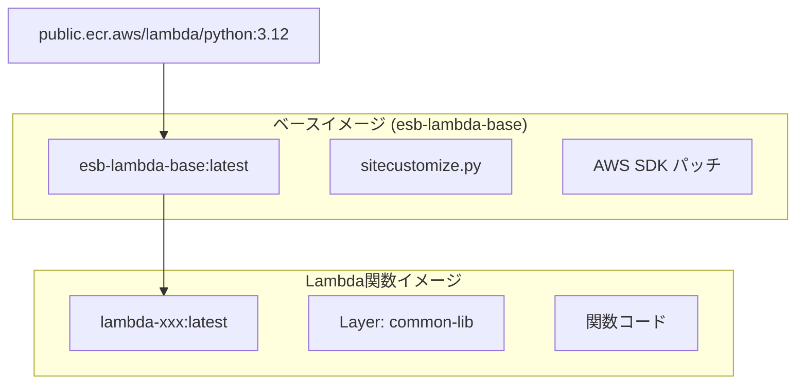
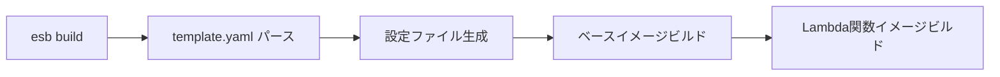
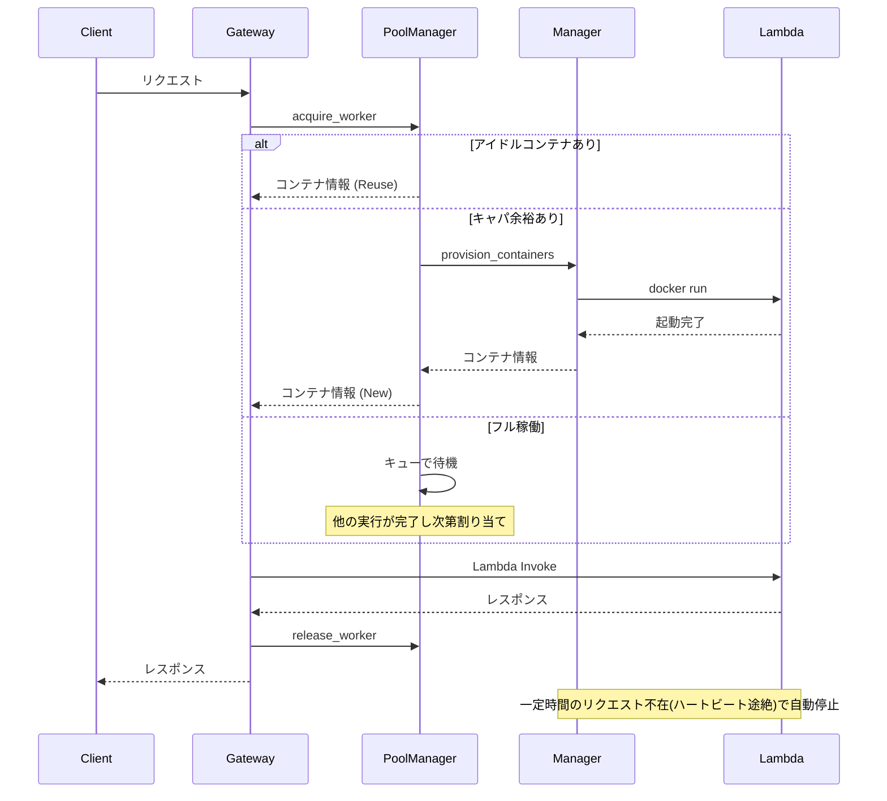

# コンテナ管理とイメージ運用

本ドキュメントでは、Edge Serverless Box (ESB) のコンテナ管理とイメージビルドの仕組みについて解説します。

## イメージ階層構造

ESB は効率的なビルドのために、階層化されたイメージ構造を採用しています。



| レイヤー           | 内容                             | 更新頻度 |
| ------------------ | -------------------------------- | -------- |
| AWS Lambda RIE     | 公式Pythonランタイム             | 低       |
| `esb-lambda-base`  | sitecustomize.py (AWS SDKパッチ) | 低       |
| Lambda関数イメージ | Layers + 関数コード              | 高       |

## ビルドプロセス

`esb build` コマンドを実行すると、以下の順序でビルドが行われます。



### ベースイメージ (`esb-lambda-base`)

**ソース**: `tools/generator/runtime/`

```
tools/generator/runtime/
├── Dockerfile.base
└── site-packages/
    └── sitecustomize.py    # AWS SDK パッチ & Direct Logging
```

ベースイメージには以下が含まれます:
- **sitecustomize.py**: Python 起動時に自動ロードされ、AWS SDK の挙動修正とログの送信を行います。

### Lambda関数イメージ

**ソース**: Generator により自動生成

生成される Dockerfile:
```dockerfile
FROM esb-lambda-base:latest

# Layer (template.yaml で定義)
COPY tests/fixtures/layers/common/ /opt/

# 関数コード
COPY tests/fixtures/functions/xxx/ ${LAMBDA_TASK_ROOT}/

CMD [ "lambda_function.lambda_handler" ]
```

## コンテナライフサイクル

Lambda RIE コンテナは Manager により動的に管理されます。Manager は再起動時にも実行中のコンテナを認識し、管理下に復帰させる **Adopt & Sync** 機能を備えています（詳細は [manager-restart-resilience.md](./manager-restart-resilience.md) を参照）。



### コンテナ状態遷移

| 状態           | 説明                                     |
| -------------- | ---------------------------------------- |
| `STOPPED`      | コンテナ未起動                           |
| `PROVISIONING` | 新規コンテナ作成中                       |
| `BUSY`         | リクエスト処理中（プールから払い出し中） |
| `IDLE`         | リクエスト待機中（プール内で再利用可能） |
| `CLEANUP`      | 長期間未使用による自動削除対象           |

## 運用コマンド

### イメージ管理

```bash
# 全イメージを強制リビルド
esb build --no-cache

# サービス起動時にリビルド
esb up --build
```

### 未使用イメージのクリーンアップ

```bash
# ESB関連のみをクリーンアップ（推奨）
docker images | grep -E "^(esb-|lambda-)" | awk '{print $3}' | xargs docker rmi

# 全 dangling イメージを削除（注意: 他プロジェクトにも影響）
docker image prune -f
```

### コンテナログの確認

```bash
# 特定のLambdaコンテナログ
docker logs lambda-xxx

# リアルタイム監視
docker logs -f lambda-xxx
```

## トラブルシューティング

### 問題: 古いコードが実行される

**原因**: イメージが再ビルドされていない

**解決策**:
```bash
esb build --no-cache
esb up --build
```

### 問題: 大量の `<untagged>` イメージ

**原因**: 頻繁なリビルドによる中間レイヤーの蓄積

**解決策**:
```bash
docker image prune -f
```

### 問題: コンテナが起動しない

**確認手順**:
```bash
# Manager ログの確認
docker logs esb-orchestrator

# コンテナ状態の確認
docker ps -a | grep lambda-
```
