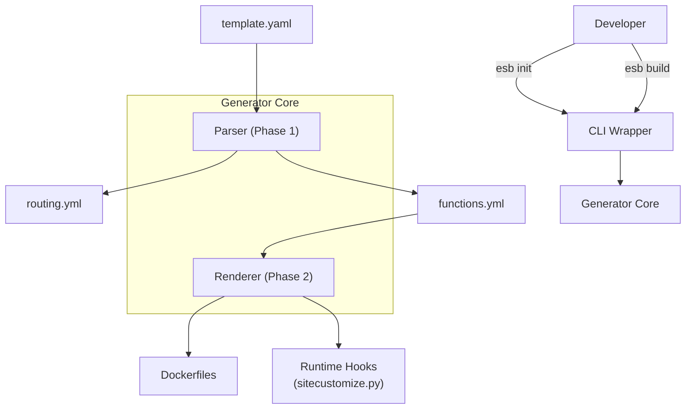

# SAM Generator Architecture

## 概要

`tools/generator` は、AWS SAM テンプレート (`template.yaml`) を解析し、ESB (Edge Serverless Box) 上で実行可能な設定ファイルと Docker アーティファクトを生成する中核コンポーネントです。

このプロセスにより、開発者は `Dockerfile` や `docker-compose.yml` を手動でメンテナンスする必要がなく、SAM テンプレートを "Single Source of Truth" として開発を進めることができます。

## アーキテクチャ構成



### コンポーネント

1.  **CLI Wrapper (`tools/cli`)**
    ユーザーインターフェースを提供し、生成プロセスをオーケストレーションします。

2.  **Parser (`tools/generator/parser.py`)** -> **Phase 1**
    SAM テンプレートを解析し、中間設定ファイル（`routing.yml`, `functions.yml`）を生成します。
    - `AWS::Serverless::Function` リソースの抽出
    - `Events` プロパティからの API ルーティング情報の抽出
    - `ReservedConcurrentExecutions` からの最大同時実行数 (`max_capacity`) の抽出

3.  **Renderer (`tools/generator/renderer.py`)** -> **Phase 2**
    抽出された関数メタデータに基づき、Jinja2 テンプレートを使用して具体的なランタイムアーティファクトを生成します。
    - `Dockerfile` の生成（ランタイムバージョンに応じたベースイメージ選択）
    - `sitecustomize.py` などのフックファイルの注入

## 生成プロセス詳細

### 1. 初期化 (`esb init`)

プロジェクト開始時に実行され、生成設定ファイル `generator.yml` を作成します。

- **入力**: ユーザー入力（対話形式）、`template.yaml` のパラメータ定義
- **出力**: `generator.yml`
    - SAM パラメータの値
    - Docker イメージのタグ
    - 出力ディレクトリパス（デフォルト: `.esb/`）

### 2. ビルドフェーズ (`esb build`)

#### Phase 1: 設定生成
`template.yaml` を読み込み、ESB が理解できる形式の中間ファイルを作成します。

**出力例 (`routing.yml`)**:
```yaml
routes:
  - path: /hello
    method: get
    function: lambda-hello
```

#### Phase 2: アーティファクト生成
`functions.yml` に列挙された各関数について、Docker ビルドコンテキストを用意します。

1. **Dockerfile の生成**
    テンプレート (`tools/generator/templates/Dockerfile.j2`) から生成されます。
    ```dockerfile
    FROM porurucode/esb-lambda-base:python3.12
    # ...
    COPY . .
    # ...
    ```

2. **Runtime Hooks の配置**
    `tools/generator/runtime/site-packages/` 配下のファイルが、各関数のビルドコンテキストにコピーされます。
    これにより、以下の機能が全 Lambda 関数に自動的に組み込まれます：
    - Trace ID の自動伝播 (`sitecustomize.py`)
    - ログの自動送信 (VictoriaLogs)
    - 標準出力のキャプチャ

## ランタイムフックの仕組み (`sitecustomize.py`)

ESB は、Python の `sitecustomize` 機構を利用して、ユーザーコードを変更することなくランタイムの挙動を拡張しています。

### Trace ID Hydration (復元)
Lambda RIE は `X-Amzn-Trace-Id` ヘッダーを環境変通に変換しません。
`sitecustomize.py` は、`awslambdaric` にパッチを適用し、**ClientContext** から Trace ID を取り出して `_X_AMZN_TRACE_ID` 環境変数にセットします。

### Direct Logging
`sys.stdout` と `sys.stderr` をフックし、ログ出力をキャプチャして VictoriaLogs に非同期で送信します。これにより、ローカル環境でも本番同様のログ集約が可能になります。
