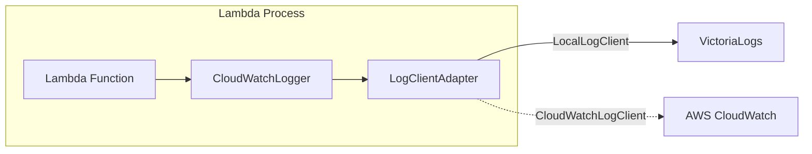

# ローカル環境用ログアダプター設計

## 概要

Lambda関数の`CloudWatchLogger`を、ローカル環境ではVictoriaLogsへ送信します。

**既存のLambdaコードの修正は不要です。**

## 構成

## 環境変数

| 変数                    | 説明               |
| ----------------------- | ------------------ |
| `LOCAL_LAMBDA_ENV=true` | ローカル環境フラグ |

## VictoriaLogs UI

- URL: `http://localhost:9428/select/vmui`
- 検索例: `log_group:"/local/lambda/system"`

## 関連ファイル

- `lambda_functions/LayerLib/.../cloudwatch_logger.py` - アダプター実装
- `docker-compose.yml` - VictoriaLogsサービス定義 (ポート9428公開)
