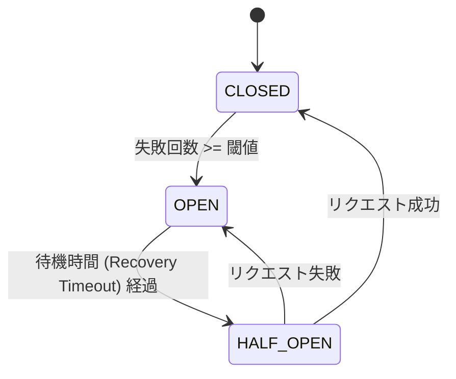

# System Resilience & Reliability

## 概要
本ドキュメントでは、ESB (Edge Serverless Box) におけるシステム全体の信頼性設計、特に障害検知・遮断・復旧のメカニズムについて解説します。

## 1. Circuit Breaker (Gateway)

Gateway サービスには、Lambda 関数（コンテナ）へのリクエスト失敗を監視し、障害が継続する場合にシステムの巻き添えを防ぐための **サーキットブレーカー (Circuit Breaker)** が実装されています。

### 動作仕様
各 Lambda 関数ごとに独立したブレーカーを持ち、以下の3つの状態を遷移します。

- **CLOSED (通常)**: リクエストを通常通り転送します。失敗をカウントします。
- **OPEN (遮断)**: 即座にエラー (`503 Service Unavailable` 相当) を返し、バックエンドへのアクセスを行いません。これにより、障害中のコンテナへの負荷を軽減し、Gateway のリソース枯渇を防ぎます。
- **HALF_OPEN (試行)**: 1回だけリクエストを通します。成功すれば CLOSED に復帰し、失敗すれば即座に OPEN に戻ります。

> [!NOTE]
> **コンテナプールとの連携**: サーキットブレーカーが OPEN の状態でも、リクエストは一度コンテナプールからワーカーを確保 (`acquire`) しようとします。これにより同時実行数が制御されますが、ブレーカーによって即座に拒否された場合、ワーカーは直ちにプールに返却 (`release`) され、リソースは解放されます。

### 設定パラメータ
環境変数で調整可能です。

| 環境変数                           | デフォルト | 説明                                               |
| ---------------------------------- | ---------- | -------------------------------------------------- |
| `CIRCUIT_BREAKER_THRESHOLD`        | `5`        | 連続失敗回数の閾値                                 |
| `CIRCUIT_BREAKER_RECOVERY_TIMEOUT` | `30.0`     | OPEN から HALF_OPEN に遷移するまでの待機時間（秒） |

### 判定基準
以下のケースを「失敗」とカウントします。
- HTTP ステータス 500 以上
- ネットワークエラー（接続拒否、タイムアウト）
- Lambda RIE からのシステムエラー (`X-Amz-Function-Error` ヘッダ)

---

## 2. Container Lifecycle Management (Manager)

Lambda RIE コンテナは **Manager Service** によって動的に管理されます。
リソース効率と応答速度のバランスを取るため、以下の戦略を採用しています。

- **オンデマンド起動**: リクエストが来た時点でコンテナを起動します（Cold Start）。コンテナキャッシュにより2回目以降は高速に応答します（Warm Start）。
- **アイドル停止**: 一定時間（デフォルト: 5分）リクエストがないコンテナは自動的に停止・削除されます。

詳細は [container-management.md](./container-management.md) を参照してください。

---

## 3. Orchestrator Restart Resilience

Orchestrator サービス自体が再起動した場合でも、実行中の Lambda コンテナを見失わないように設計されています。

- **Adopt & Sync**: Orchestrator 起動時に Docker 上の既存コンテナをスキャンし、ESB 管理下のコンテナ（`created_by=esb`）を自身の管理テーブルに復元します。
これにより、Orchestrator のアップデートや再起動中も Lambda コンテナは稼働し続け、サービス断を最小限に抑えます。

詳細は [orchestrator-restart-resilience.md](./orchestrator-restart-resilience.md) を参照してください。

---

## 4. エラーハンドリング仕様

クライアントに返却される主なエラーコードとその意味：

| ステータスコード          | 原因                                                                 |
| ------------------------- | -------------------------------------------------------------------- |
| `404 Not Found`           | 指定されたパスに対応する Lambda 関数が定義されていない (Routing)     |
| `502 Bad Gateway`         | コンテナ起動失敗、または Lambda 関数内で未処理の例外が発生           |
| `503 Service Unavailable` | サーキットブレーカー作動中、または Manager サービスダウン            |
| `504 Gateway Timeout`     | Lambda 関数の実行がタイムアウト設定 (`LAMBDA_INVOKE_TIMEOUT`) を超過 |

