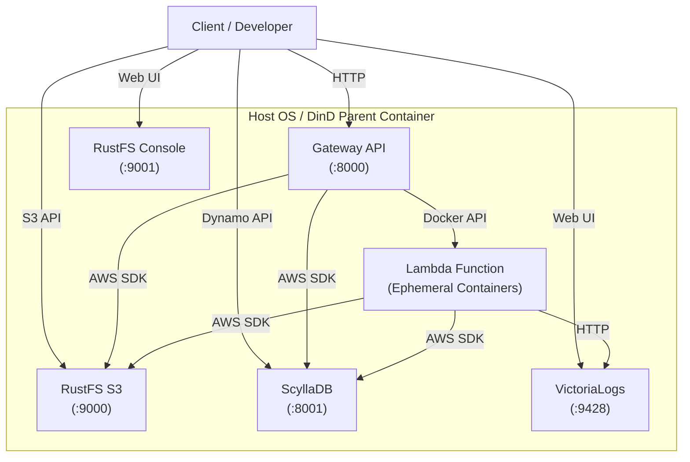

# システム仕様書

## 1. 概要
本システムは、コンテナ技術(Docker)を用いてエッジサーバーレス環境をシミュレートするための基盤です。単一のDinDコンテナ内に、Gateway、ストレージ、データベース、Lambda実行環境を集約しています。

## 2. コンポーネント構成

システムは以下の主要コンポーネントで構成されます。

### 2.1 Gateway API (FastAPI)
- **役割**: クライアントからのリクエスト受付、認証、およびLambda関数のルーティングと実行管理。
- **通信**: クライアントとはHTTPで通信。内部でDocker APIを使用してLambdaコンテナを制御。
- **ポート**: `8000`

### 2.2 RustFS (Storage)
- **役割**: AWS S3互換のオブジェクトストレージ。Lambdaコードやデータの保存に使用。
- **構成**:
    - **API**: ポート `9000` (S3互換)
    - **Console**: ポート `9001` (管理Web UI)
- **認証**: 環境変数でAccessKey/SecretKeyを設定。

### 2.3 ScyllaDB (Database)
- **役割**: Dockerコンテナ向けの高性能NoSQLデータベース。AWS DynamoDB互換API (Alternator) を提供。
- **ポート**: `8001` (Alternator API)

### 2.4 VictoriaLogs
- **役割**: ログ収集・管理基盤。LambdaやGatewayのログを集約可。
- **ポート**: `9428` (Web UI/API)

## 3. ネットワーク仕様

Traefik等のリバースプロキシを使用せず、各コンテナのポートをホストに直接マッピングします。

| サービス名     | コンテナ内ポート | ホスト公開ポート | URL                     | プロトコル          |
| -------------- | ---------------- | ---------------- | ----------------------- | ------------------- |
| Gateway API    | 8000             | 8000             | `http://localhost:8000` | HTTP                |
| RustFS API     | 9000             | 9000             | `http://localhost:9000` | HTTP                |
| RustFS Console | 9001             | 9001             | `http://localhost:9001` | HTTP                |
| ScyllaDB       | 8000             | 8001             | `http://localhost:8001` | HTTP (DynamoDB API) |
| VictoriaLogs   | 9428             | 9428             | `http://localhost:9428` | HTTP                |

## 4. データ永続化

データの永続化はDocker Volumeを使用し、ホストOSのディレクトリをマウントします。

- **ホストパス**: `./data/` (プロジェクトルート直下)
- **マウント構成**:
    - `s3_storage` -> RustFSデータ
    - `scylladb` -> ScyllaDBデータ
    - `victorialogs` -> ログデータ

## 5. デプロイメントモデル

### 5.1 開発環境 (Docker Compose)
`docker-compose.yml` を使用して、ホストOS上で直接サービス群を起動します。
- ボリューム: `./data` (相対パス)

### 5.2 本番/検証環境 (DinD)
`docker-compose.dind.yml` を使用して、親コンテナ(`onpre-app-root`)を起動します。
- 親コンテナが内部でさらに `docker-compose.yml` を使用して子コンテナ群を起動します。
- ホストの `./data` は親コンテナの `/app/data` にマウントされ、子コンテナに引き継がれます。
